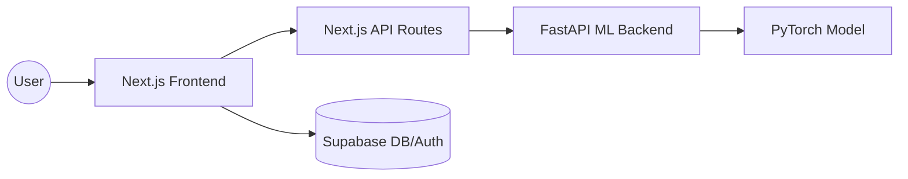

# 🫁 PneumoScan AI

[](https://opensource.org/licenses/MIT)
[](https://nextjs.org/)
[](https://fastapi.tiangolo.com/)
[](https://pytorch.org/)

**PneumoScan AI** is an advanced, explainable AI platform designed for rapid triage of pneumonia in chest radiographs. Built for clinical efficiency, it provides radiologists with high-accuracy predictions coupled with interpretability heatmaps.


## 🚀 Key Features

- **Explainable AI (XAI):** Uses Grad-CAM to generate visual heatmaps, highlighting specific thoracic regions used by the model for its decision.
- **High Precision:** Reaches **96% accuracy** on the RSNA Pneumonia Detection dataset.
- **Instant Triage:** Analysis completed in seconds, prioritizing critical cases for immediate review.
- **Medical Reports:** Generate professional PDF reports with findings, patient metadata, and timestamps.
- **Cloud-Ready:** Scalable architecture designed for deployment on Cloudflare Pages and modern container platforms.

## 🛠️ Tech Stack

- **Frontend:** Next.js 15, Tailwind CSS, Shadcn UI, Lucide Icons.
- **Backend:** FastAPI (Python), PyTorch, Torchvision.
- **Database/Auth:** Supabase.
- **Visualization:** Recharts, Matplotlib (Backend).

## 📂 Project Architecture



## ⚙️ Getting Started

### Backend Setup (ML API)
1. Navigate to the backend directory:
   ```bash
   cd backend
   ```
2. Install dependencies:
   ```bash
   pip install -r requirements.txt
   ```
3. Run the FastAPI server:
   ```bash
   uvicorn main:app --reload
   ```

### Frontend Setup
1. Navigate to the frontend directory:
   ```bash
   cd frontend
   ```
2. Install dependencies:
   ```bash
   npm install
   ```
3. Set up environment variables:
   Create a `.env.local` file based on `.env.example`.
4. Run the development server:
   ```bash
   npm run dev
   ```

## ☁️ Deployment

### Frontend (Cloudflare Pages)
- Push the `frontend` directory to GitHub.
- Connect your repository to Cloudflare Pages.
- Set the **Build command** to `npm run build` and **Output directory** to `.next`.
- Add environment variables (`NEXT_PUBLIC_SUPABASE_URL`, etc.).

### Backend
- Deploy the `backend` directory to a platform supporting Python (e.g., Render, Fly.io, or AWS).
- Ensure the model weights in `backend/models/best_model.pth` are included in your deployment.

## 📊 Dataset
The model is trained on the RSNA Pneumonia Detection dataset. For local testing, you can place your X-ray images in the `pneumonia_xrays` directory.

## ⚖️ Disclaimer
*This tool is for demonstration and research purposes only. It is not a certified medical device and should not be used for clinical diagnosis without the supervision of a certified radiologist.*

## 📄 License
Distributed under the MIT License. See `LICENSE` for more information.
